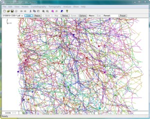

## MCTrace <A href="https://scicrunch.org/scicrunch/Resources/record/nlx_144509-1/SCR_016532/resolver">RRID:SCR_016532</A>
MCTrace is a program for skeletonized model building and refinement with a graphical user interface. It consists of over 50,000 lines of custom source code in C++ and uses DirectX 9.0 API. 

Neuronal circuits, which are essential for brain functions, are built up by neurons as a 3D network, so tracing the 3D neuronal network of brain is the first step to understanding the mechanism of brain functions. We demonstrated that a skeletonized model of neuronal processes can be built by tracing the 3D coefficient map. An example of the obtained network model of human brain tissue using MCTrace is shown left. In this process, the 3D image was converted into 3D Cartesian coordinates by model building. The 3D coordinates are easier to handle than the image itself, making it possible to analyze the geometry of brain network. The entire 3D network of fly brain hemisphere appeared in <a href="https://www.technologyreview.com/s/602398/first-3-d-map-of-a-fruit-flys-brain-network/">MIT Technology Review</a> were built with this software. 

## License
MCTrace is provided under the BSD 2-Clause License.

## References
<ul>
<LI>R. Mizutani et al (2021). Structural diverseness of neurons between brain areas and between cases. <I>Transl. Psychiatry</I> <B>11</B>, 49. 
 <a href="https://doi.org/10.1038/s41398-020-01173-x">DOI</a>
 <a href="https://www.nature.com/articles/s41398-020-01173-x.pdf">pdf</a>
</li>
<LI>R. Mizutaniet al (2019). Three-dimensional alteration of neurites in schizophrenia. <I>Transl. Psychiatry</I> <B>9</B>, 85. 
 <a href="https://dx.doi.org/10.1038/s41398-019-0427-4">DOI</a>
 <A href="https://arxiv.org/abs/1804.00404">arXiv</A>
</li>
<li>First 3-D Map of a Fruit Fly’s Brain Network. <i>MIT Technology Review</i> (Sep 16, 2016). 
 <a href="https://www.technologyreview.com/s/602398/first-3-d-map-of-a-fruit-flys-brain-network/">link</a>
</li>
<li>R. Mizutani et al (2013). Three-dimensional network of <i>Drosophila</i> brain hemisphere. 
 <i>J. Struct. Biol.</i> <b>184(2)</b>, 271-279.
 <a href="http://dx.doi.org/10.1016/j.jsb.2013.08.012">DOI</a>
 <a href="http://www.ncbi.nlm.nih.gov/pubmed/24012710">PubMed</a> 
 <a href="http://arxiv.org/abs/1609.02261">arXiv</a> 
</li>
<LI>R. Mizutani et al (2010). Microtomographic analysis of neuronal circuits of human brain. <I>Cerebral Cortex</I> <B>20(7)</B>, 1739-1748.
<a href="http://dx.doi.org/10.1093/cercor/bhp237">DOI</A>
<a href="http://www.ncbi.nlm.nih.gov/pubmed/19915092">PubMed</A>
</li>
</ul>

## Release notes
The MCTrace executable 'kozo---.exe' is available from the Releases pane on the right. This page was previously posted in our lab site and moved from there in 2016. 

<UL>
  <li>Build Dec-25-2020. Functions including those for the analysis of vessel strucrures were implemented.</li>
  <li>v3.8.0 (21 Mar 2018). Many functions including improved auto-tracing, structure annoation, geometry analysis, and SWC file loading routines were implemented. You can use MCTrace to view SWC files, such as those available from NeuroMorpho.Org.</li>
  <li>v3.5.0 (6 Jan 2017) Routines for <a href="https://github.com/mizutanilab/BluetoothDials">Bluetooth Dials</a> were implemented.</li>
  <li>v3.4.1 (2 Nov 2016). Bug fix release.</li>
  <li>v3.4.0 (built 1 Apr 2016). Many functions including those for the left-hand mouse were implemented.</li>
  <li>v3.2.8 (built 27 May 2013). x64 platform is now supported. Functions for crystallographic analysis were disabled and not supported from this release.</li>
  <li>v2.2.1 (relesed 6 Dec 2010). Graphics are accelerated with DirectX libraries. Functions for microtomographic analysis were thoroughly updated.</li>
  <li>v2.0.2 (released 9 Jun 2009). Functions for tomographic analysis were implemented.</li>
  <li>v1.0.2 (released 9 Jan 2007). Cut, copy and paste functions were debugged. Refinement dialog was updated. Users now can specify regions to be refined.</li>
  <li>v1.0.1 (released 12 Dec 2006). Cut, copy and paste functions were implemented. Exponential subroutine was replaced with a custom one. This makes the structure factor calculation over three times faster than before.</li>
  <li>v1.0.0 is released (12 Nov 2006).</li>
</UL>

## How to use
We believe that this program is self-explanatory. The following tips might be helpful.

<B>Installation</B>  
Place the MCTrace executable to any folder you like.

<B>Execution</B>  
Double click the 'MCTrace' executable.

<B>Open model</B>  
From the menu bar, select 'File'-'Open' and choose a coordinate file. Click the 'OK' button. Double-click a node to highlight it and select 'Focus' from the right click menu. This will bring the highlighted node to the center of the window. You can focus on any particular part of the model by selecting 'View'-'Focus'. If you have no model coordinate, 'File'-'New' generates a new model.

<B>Three-dimensional coefficient map</B>  
Select 'Model building'-'Load slices' to load tomographic slices in TIFF format. After the map files were loaded, open the map dialog from the 'Model building'-'Coeff map' menu, select 'Generate new map', and enter parameters of 'CT mesh' and 'Display' region. Enable one of map 'Contours' and set an approriate contour level in 'sigma' (standard deviation of your map). A recommended value of the contour level is '3'. 'Apply' invokes the map update.

<B>Modify model</B>  
First, double click the model to be modified, deleted, or otherwise manipulated. Select 'Edit'-'Delete' to delete part of the model or 'Move' to rotate or translate. The double-clicked node can be moved by mouse dragging.

<B>Statistical analysis</B>  
The 'Analyze' menu provides a number of analysis tools.

<B>Refinement</B>  
Open the 'Model building'-'Refine' dialog. Enter appropriate parameters for dynamics and/or minimization calculation. 'Start' executes refinement. Models under refinement are dynamically displayed and can be manipulated.

## Frequently asked questions
<OL>
  <LI><b>System requirements</b></LI>
    MCTrace runs on most of Windows laptop and desktop PCs.  
  <LI><b>Manuals</b></LI>
    We have no manuals appropriate for the current version.  
</OL>

## Contact
Ryuta Mizutani, Dr., Prof.  
Department of Applied Biochemistry  
School of Engineering, Tokai University  
Kitakaname 4-1-1, Hiratsuka, Kanagawa 259-1292, Japan  
E-mail mizutanilaboratory(at)gmail.com  
https://mizutanilab.github.io/ 
<A href="http://www.linkedin.com/pub/ryuta-mizutani/79/832/115">Linkedin</A> - 
<A href="http://www.youtube.com/user/mizutaniLab">YouTube</A>
 
